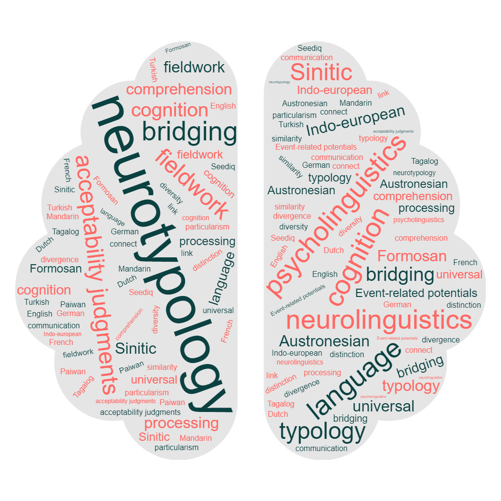

 

<b>New! (2023/10/21)</b> The article "Past and future time reference processing teased apart in Paiwan, an endangered Formosan language" (in collaboration with Dr. Elizabeth Zeitoun) is now available in <i>Language and Cognition</i> (open access)! 

<b>New! (2023/09/01)</b> I am happy to present the study entitled "Neurotypological considerations of temporal concord processing" at the <i>Crosslinguistic Perspectives on Processing and Learning Workshop (X-PPL)</i> on November 6-8!

 

### Short bio

I am currently a postdoctoral researcher at the Institute of Linguistics of Academia Sinica, Taiwan. I work on my own project entitled "On the expression of temporal reference with modal information from a morphosyntactic and psycho-/neuro-linguistic perspective: The case of ‘<i>you</i> (to have) + VP’ in Taiwan Mandarin".

I graduated from the PhD program of the department of English of National Taiwan Normal University (Linguistic track). During my PhD studies, I was also the manager of the [Neurolinguistics Lab](https://sites.google.com/view/neurolinguisticslabntnu) of National Taiwan Normal University, where I supervized behavioral, ERP and fMRI experiments about a great variety of language-related topics, such as language relativity, classifier processing or conceptual categorization.

### Research interests

My research interests combine two disciplines: linguistics and language processing.

* On the linguistic side, I am interested in the syntax and semantics of the expression of TIME from a functional syntax and user-based perspective. Particularly, I aim at understanding how temporal relations are expressed with grammatical markers in Mandarin Chinese (and its variety spoken in Taiwan), which is said to be a tenseless language.
* On the psycholinguistic and neurolinguistic side, I have mainly worked in sentence processing with a focus on the processing of temporality (tense, aspect, modality) in grammar. 

I aim at bridging linguistic analyses with their brain processing patterns in order to establish a neurolinguistic and crosslinguistic model of the processing of temporality at the sentence level. Although I have mainly conducted my research on Mandarin Chinese, I also wish to expand my research to other languages, especially languages which are underrepresented in the language processing domain.

 
My research interests lie in the following  topics (click on the image for more details):

  

    
    

<b>Temporal reference in (Taiwan) Mandarin: Syntax and semantics</b>

  

  

    
    
<b>Processing temporal information in (Taiwan) Mandarin</b>

  

  

    
    
<b>Neurotypology: Linguistic and cognitive diversities of language processing</b>

  

  

    
    
<b>Applied language processing: Translation and language teaching</b>

  

 
Last update: 2023/10/21