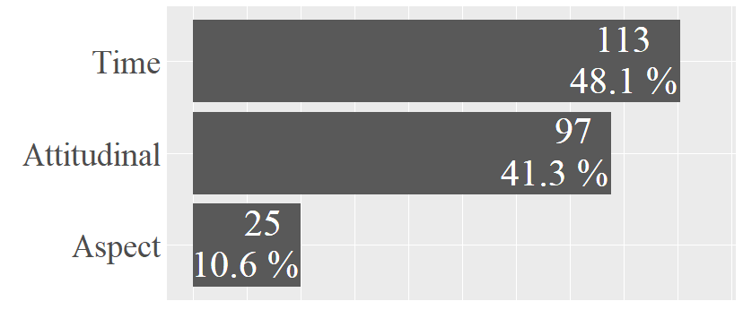
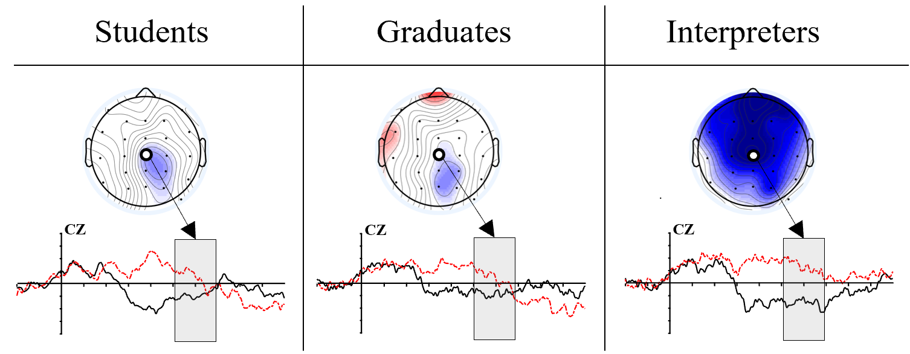
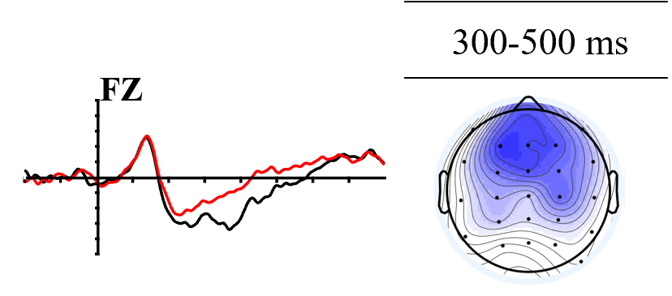

<i>* = corresponding author</i>

---

**Expressing the existence of an event with ‘you (to have) + VP’ in Taiwan Mandarin: A corpus-based investigation** 
<u>Collart, A.</u>*, & Su, H.-K.  

In <i>Concentric: Studies in Linguistics</i>, Accepted for publication.

---

**When two languages are competing: An ERP study on sentence processing in expert and novice interpreters** 
Fan, C.D., <u>Collart, A.</u>, & Chan, S.*  

In <em>Interpreting</em>, 2022. [[Paper](https://doi.org/10.1075/intp.00069.fan)] 

---

**Processing past time reference in a tenseless language: An ERP study on the Mandarin aspectual morphemes <i>-le</i> and <i>-guo</i>** 
<u>Collart, A.</u>*, & Chan, S. 

In <em>Journal of Neurolinguistics</em>, 2021. [[Paper](https://doi.org/10.1016/j.jneuroling.2021.100998)] 

---
---

# Manuscripts

## Submitted manuscript(s)
* <ins>Collart, A.</ins> (under review). <b>Time reference, Mandarin aspect marker -le, and the brain: A tenseless analysis.

* <ins>Collart, A.</ins>, and Zeitoun, E. (submitted). <b>Past and future time reference processing teased apart in Paiwan, a non-LOL language</b> (Working title)

## Manuscripts in preparation
* <ins>Collart, A.</ins> (in preparation). <b>Experimental linguistics embracing linguistic diversity: On the contribution of Formosan languages to models of sentence processing.</b> (working title)

* <ins>Collart, A.</ins> (in preparation). <b>Linguistic diversity meeting the brain: Towards a neurotypological model of sentence processing of the expression of time.</b> (working title)

* <ins>Collart, A.</ins>, and Chan, S. (in preparation). <b>Processing past time and aspect in the Mandarin brain: What is it all about?</b> (Working title)

* Chan, S., <ins>Collart, A.</ins>, Chang, I., and Hu, S. (in preparation). <b>Linguistic relativity: Modulation of classifiers on object perception.</b> (Working title)

* Su, H.-K., and <ins>Collart, A.</ins> (in preparation). <b>Applying random forests analyses on emerging syntactic constructions: The case of ‘you (to have) + VP’ in Taiwan Mandarin.</b> (working title)