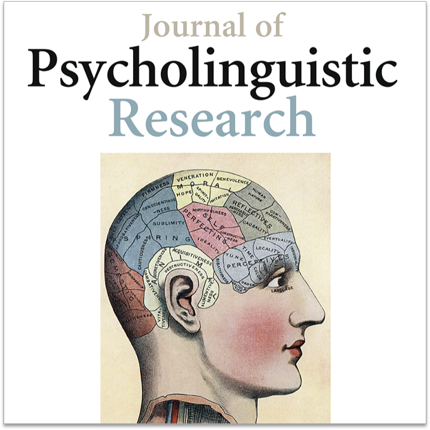

<i>* = corresponding author</i>

 

<b> &nbsp;&nbsp;Peer-reviewed articles</b>

<!-- Article 6 -->

  

  

  <a href="" target="_blank">
<b>It costs to exist: Acceptability judgments of the temporal concord of the auxiliary verbs  <i>you</i> and <i>hui</i> in Taiwan Mandarin.</b>
</a>

  
In <i>Journal of Psycholinguistic Research</i>, Accepted.

  
<i class="fa fa-quote-left" aria-hidden="true"></i>&nbsp;&nbsp;<u>Collart, A.</u>* (accepted). It costs to exist: Acceptability judgments of the temporal concord of the auxiliary verbs <i>you</i> and <i>hui</i> in Taiwan Mandarin. <i>Journal of Psycholinguistic Research</i>.
  

 

---

<!-- Article 5 -->

  

  

  <a href="" target="_blank">
<b>A decade of language processing research: Which place for linguistic diversity?</b>
</a>

  
In <i>Glossa Psycholinguistics</i>, Accepted.

  
<i class="fa fa-quote-left" aria-hidden="true"></i>&nbsp;&nbsp;<u>Collart, A.</u>* (accepted). A decade of language processing research: Which place for linguistic diversity? <i>Glossa Psycholinguistics</i>.
  

 

---

<!-- Article 4 -->

  

  

  <a href="https://www.cambridge.org/core/journals/language-and-cognition/article/past-and-future-time-reference-processing-teased-apart-in-paiwan-an-endangered-formosan-language/2816D5906BF51FF82847E87E5D7A93D1" target="_blank">
<b>Past and future time reference processing teased apart in Paiwan, an endangered Formosan language.</b>
</a>

  
In <i>Language and Cognition</i>, 2023.

  
<i class="fa fa-quote-left" aria-hidden="true"></i>&nbsp;&nbsp;<u>Collart, A.</u>*, & Zeitoun, E. (2023). Past and future time reference processing teased apart in Paiwan, an endangered Formosan language. <i>Language and Cognition</i>, 1-26. <i>First view article</i>.
  

 

---

<!-- Article 3 -->

  

  

  <a href="https://doi.org/10.1075/consl.21046.col" target="_blank">
<b>Expressing the existence of an event with ‘<i>you</i> (to have) + VP’ in Taiwan Mandarin: A corpus-based investigation.</b>
</a>

  
In <i>Concentric: Studies in Linguistics</i>, 2022.

  
<i class="fa fa-quote-left" aria-hidden="true"></i>&nbsp;&nbsp;<u>Collart, A.</u>*, & Su, H.-K. (2022). Expressing the existence of an event with ‘you (to have) + VP’ in Taiwan Mandarin: A corpus-based investigation. <i>Concentric: Studies in Linguistics</i>, <i>48</i>(2), 249-284.
  

 

---

<!-- Article 2 -->

  

  

  <a href="https://doi.org/10.1075/intp.00069.fan" target="_blank">
<b>When two languages are competing: An ERP study on sentence processing in expert and novice interpreters.</b>
</a>

  
In <i>Interpreting</i>, 2022.

  
<i class="fa fa-quote-left" aria-hidden="true"></i>&nbsp;&nbsp;Fan, C. D., <u>Collart, A.</u>, & Chan, S.* (2022). When two languages are competing: An ERP study on sentence processing in expert and novice interpreters. <i>Interpreting</i>, <i>24</i>(1), 1-37.
  

 

---

<!-- Article 1 -->

  

  

  <a href="https://doi.org/10.1016/j.jneuroling.2021.100998" target="_blank">
<b>Processing past time reference in a tenseless language: An ERP study on the Mandarin aspectual morphemes <i>-le</i> and <i>-guo</i>.</b>
</a>

  
In <i>Journal of Neurolinguistics</i>, 2021.

  
<i class="fa fa-quote-left" aria-hidden="true"></i>&nbsp;&nbsp;<u>Collart, A.*</u>, & Chan, S.* (2021). Processing past time reference in a tenseless language: An ERP study on the Mandarin aspectual morphemes -le and -guo. <i>Journal of Neurolinguistics</i>, <i>59</i>, Article 100998.
  

 

<b> &nbsp;&nbsp;Book chapters (peer-reviewed)</b>

<!-- Chapter 2 -->

  

  

  <a href="https://referenceworks.brill.com/display/entries/HFLO/COM-204030.xml" target="_blank">
<b>Review of indigenous language teaching and beyond in Taiwan: The race against time.</b>
</a>

  
In <i>Handbook of Formosan languages: The indigenous languages of Taiwan</i>, accepted.

  
<i class="fa fa-quote-left" aria-hidden="true"></i>&nbsp;&nbsp;<u>Collart, A.*</u>, Wu, J. J., & Huang, L. M. (2023). Review of indigenous language teaching and beyond in Taiwan: The race against time. In P. Li, E. Zeitoun, & R. De Busser (Eds.), <i>Handbook of Formosan languages: The indigenous languages of Taiwan</i> (Brill Reference Online), Leiden: Brill.
  

 

---

<!-- Chapter 1 -->

  

  

  <a href="https://referenceworks.brill.com/display/entries/HFLO/COM-202230.xml" target="_blank">
<b>Experimental linguistics embracing linguistic diversity: On the contributions of Formosan languages to models of sentence processing.</b>
</a>

  
In <i>Handbook of Formosan languages: The indigenous languages of Taiwan</i>, accepted.

  
<i class="fa fa-quote-left" aria-hidden="true"></i>&nbsp;&nbsp;<u>Collart, A.*</u> (2023). Experimental linguistics embracing linguistic diversity: On the contributions of Formosan languages to models of sentence processing. In P. Li, E. Zeitoun, & R. De Busser (Eds.), <i>Handbook of Formosan languages: The indigenous languages of Taiwan</i> (Brill Reference Online), Leiden: Brill.
  

 

<b> &nbsp;&nbsp;Manuscripts</b>

## Manuscripts in preparation
* <ins>Collart, A.</ins> (under revision). <b>Time reference, Mandarin aspect marker -le, and the brain: A tenseless analysis.

* <ins>Collart, A.</ins> (in preparation). <b>Linguistic diversity meeting the brain: Towards a neurotypological model of sentence processing of the expression of time.</b> (working title)

* <ins>Collart, A.</ins>, and Chan, S. (in preparation). <b>Processing past time and aspect in the Mandarin brain: What is it all about?</b> (Working title)

* Chan, S., <ins>Collart, A.</ins>, Chang, I., and Hu, S. (in preparation). <b>Linguistic relativity: Modulation of classifiers on object perception.</b> (Working title)

* Su, H.-K., and <ins>Collart, A.</ins> (in preparation). <b>Applying random forests analyses on emerging syntactic constructions: The case of ‘you (to have) + VP’ in Taiwan Mandarin.</b> (working title)
