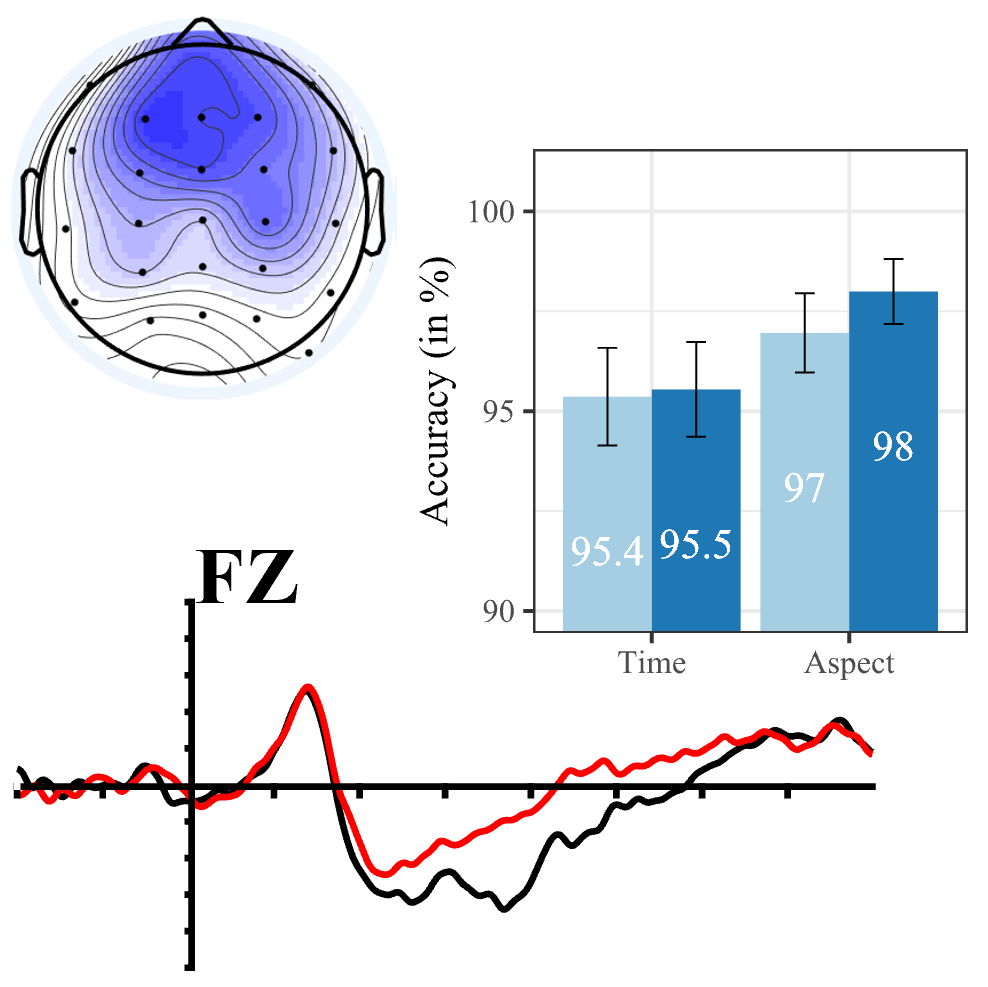

------

# Tutorials

You can have access to my tutorials byb clicking on the image.
Most of them correspond to tutorials I designed in the past. I am progressively turning them into websites to make them freely available. Stay tuned for further developments!

  

    
    

<b>Formosan languages and corpus based-studies: Hands-on practice with R/RStudio (under construction)</b>

  

  

    
    
<b>Experimental linguistics taken online: Set-up and analyses (under conceptualization)</b>

  

